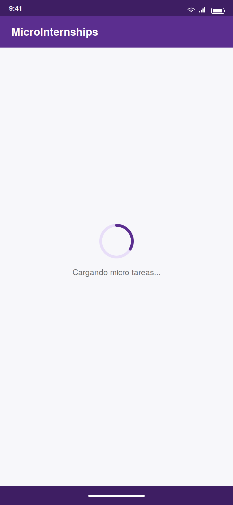
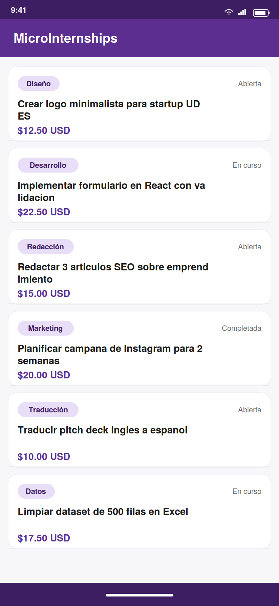
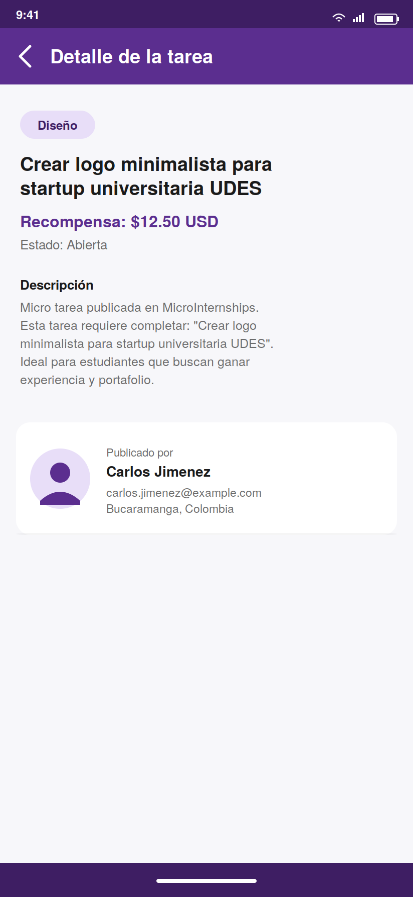
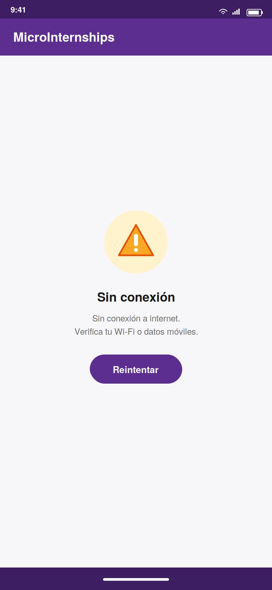
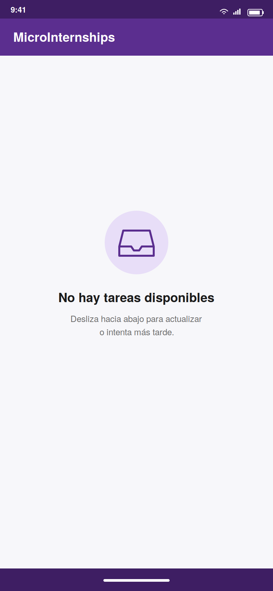

# MicroInternships — Android App (Previo P2)

App Android nativa en Kotlin que materializa la plataforma **MicroInternships** (emprendimiento universitario UDES) como cliente móvil. Permite explorar micro tareas publicadas, ver su detalle con información cruzada del publicador, y opera tanto online como offline mediante caché local con TTL.

Este proyecto cumple los requisitos del **Segundo Previo de Aplicaciones Móviles** (UDES — 2026): arquitectura de capas (MVVM + Clean), persistencia local con Room, consumo de dos APIs REST, y manejo robusto de errores.

---

## 📸 Capturas de pantalla

<p align="center">
  
  
  
</p>
<p align="center">
  
  
</p>

| # | Captura | Estado que muestra |
|---|---------|---------------------|
| 1 | `01_loading.png` | **Loading** — ProgressBar centrado al abrir la app por primera vez |
| 2 | `02_success_list.png` | **Success** — Lista de micro tareas cargadas con paginación |
| 3 | `03_detail.png` | **Detalle** — Tarea seleccionada con card del publicador (API #2) |
| 4 | `04_error.png` | **Error** — Sin conexión a internet, con botón Reintentar |
| 5 | `05_empty.png` | **Empty** — No hay tareas disponibles |

---

## 📱 Funcionalidades

- **Pantalla de lista**: muestra las micro tareas paginadas. Permite pull-to-refresh y scroll infinito.
- **Pantalla de detalle**: muestra la descripción de la tarea y el perfil del publicador (nombre, email, ubicación, avatar).
- **Estados de UI**: Loading (ProgressBar), Success (lista), Empty (mensaje amigable), Error (mensaje + botón reintentar).
- **Offline-first**: si no hay internet, se muestra la última data cacheada.
- **Caché con TTL de 15 minutos**.

---

## 🏗️ Arquitectura

Se adoptó **MVVM + principios de Clean Architecture** con tres capas:

```
ui       →   domain   ←   data
(View + ViewModel)  (modelos + contratos)  (Room + Retrofit + impl. repositorio)
```

- `ui` depende de `domain`.
- `data` depende de `domain` (implementa sus interfaces).
- `domain` no conoce ni a Retrofit ni a Room — es Kotlin puro.

### Stack técnico

| Capa     | Librerías                                                            |
|----------|----------------------------------------------------------------------|
| UI       | Fragments + ViewBinding + Navigation Component + Material 3          |
| ViewModel| `androidx.lifecycle` + `StateFlow` + `viewModelScope`                |
| DI       | **Hilt 2.50** (módulos: Network, Database, Repository)               |
| Red      | **Retrofit 2.9** + OkHttp + Gson + interceptor de retry y logging    |
| Persist. | **Room 2.6** + coroutines (`suspend` / `Flow`)                       |
| Imágenes | Glide                                                                |
| Paginación | Manual (offset/limit) con detección de scroll                      |

---

## 🔗 APIs consumidas

| #  | Nombre            | Base URL                                   | Endpoint usado             |
|----|-------------------|--------------------------------------------|----------------------------|
| 1  | JSONPlaceholder   | `https://jsonplaceholder.typicode.com/`    | `GET /todos?_start&_limit` |
| 2  | RandomUser API    | `https://randomuser.me/api/`               | `GET ?seed=&results=1`     |

Ambas son públicas y **no requieren API key**.

---

## ⚙️ Estrategia de caché (TTL)

El repositorio implementa el patrón **Single Source of Truth** con TTL de **15 minutos**:

1. El ViewModel pide datos al repositorio.
2. El repositorio consulta Room primero.
3. Si `cachedAt + 15min > ahora`, devuelve los datos locales sin golpear la red.
4. Si la caché expiró, llama a la API, guarda la respuesta en Room y la retorna.
5. Si la red falla pero hay caché (aunque expirada), se retorna la caché.

> **¿Por qué 15 minutos?** Las micro tareas no cambian con la frecuencia de un feed social; 15 min es un balance razonable entre frescura percibida y ahorro de batería/datos móviles.

---

## 🗄️ Modelo de datos (Room)

```
┌──────────────────┐        1      N   ┌──────────────┐
│ PublisherEntity  │◄──────────────────┤ TaskEntity   │
├──────────────────┤                   ├──────────────┤
│ id (PK)          │                   │ id (PK)      │
│ fullName         │                   │ title        │
│ email            │                   │ description  │
│ city             │                   │ category     │
│ country          │                   │ rewardUsd    │
│ avatarUrl        │                   │ publisherId  │◄── FK
│ cachedAt         │                   │ status       │
│ companyName      │ ← agregado en     │ isCompleted  │
└──────────────────┘    Migration 1→2  │ page         │
                                       │ cachedAt     │
                                       └──────────────┘
```

**Migración:** `MIGRATION_1_2` agrega la columna `companyName` vía `ALTER TABLE`. `fallbackToDestructiveMigration` está desactivado.

---

## 🚨 Manejo de errores

El repositorio envuelve cada llamada en un `sealed class Result<T>` que puede ser `Success`, `Error(type, message)` o `Loading`. Los tipos de error diferenciados:

| Tipo              | Origen                          | Mensaje al usuario                |
|-------------------|---------------------------------|-----------------------------------|
| `NETWORK`         | `IOException`                   | "Sin conexión a internet"         |
| `TIMEOUT`         | `SocketTimeoutException`        | "La API tardó demasiado"          |
| `NOT_FOUND`       | HTTP 404                        | "Recurso no encontrado"           |
| `SERVER`          | HTTP 5xx                        | "Error del servidor"              |
| `UNAUTHORIZED`    | HTTP 401/403                    | "No autorizado"                   |
| `PARSING`         | Gson / JSON malformado          | "Datos inválidos"                 |
| `UNKNOWN`         | Cualquier otra                  | Mensaje genérico                  |

---

## 📁 Estructura del repositorio

```
sanchez-nicolas-previo-p2/
├── app/
│   └── src/main/java/com/NicolasSnchz/microinternships/
│       ├── data/
│       │   ├── local/          ← Room (entities, DAOs, database)
│       │   ├── remote/         ← Retrofit (services, DTOs, mappers)
│       │   └── repository/     ← TaskRepositoryImpl
│       ├── domain/
│       │   ├── model/          ← Task, Publisher, Result
│       │   └── repository/     ← TaskRepository (interfaz)
│       ├── ui/
│       │   ├── tasklist/       ← Fragment + ViewModel + Adapter
│       │   ├── taskdetail/     ← Fragment + ViewModel
│       │   ├── common/         ← UiState
│       │   └── MainActivity.kt
│       └── di/                 ← NetworkModule, DatabaseModule, RepositoryModule
├── screenshots/                ← 5 capturas de los estados de la app
├── docs/                       ← sanchez_PrevioP2.pdf (documento técnico)
├── COMMITS.md                  ← guía de los 5 commits
└── README.md
```

---

## 🚀 Cómo ejecutar

### Requisitos
- Android Studio **Hedgehog** (2023.1.1) o superior.
- JDK 17.
- `minSdk` 24 / `targetSdk` 34.

### Pasos

```bash
# 1. Clonar
git clone https://github.com/NicolasSnchz/sanchez-nicolas-previo-p2.git
cd sanchez-nicolas-previo-p2

# 2. Abrir en Android Studio
#    File → Open → seleccionar la carpeta raíz

# 3. Sincronizar Gradle (automático la primera vez)

# 4. Ejecutar
#    Run → 'app'  (o Shift+F10)
```

**No se requiere API key** — las dos APIs son públicas y gratuitas.

---

## ✅ Checklist de cumplimiento del previo

- [x] Arquitectura MVVM con capas `data/`, `domain/`, `ui/`, `di/`
- [x] ViewModel por pantalla (sin lógica en Fragments)
- [x] Repository como única fuente de verdad
- [x] Hilt para inyección de dependencias
- [x] Room con 2 entidades relacionadas (1:N) y 8–10 campos cada una
- [x] DAOs con `suspend fun` y `Flow<T>`
- [x] Migración definida (1→2) sin `fallbackToDestructiveMigration`
- [x] TTL implementado (15 min) y documentado
- [x] Retrofit con 2 APIs distintas
- [x] DTOs + Mappers explícitos
- [x] `sealed class Result` con estados diferenciados
- [x] Paginación manual funcional
- [x] Coroutines en `Dispatchers.IO`
- [x] OkHttpClient con `connectTimeout`/`readTimeout`
- [x] Retry interceptor
- [x] Navegación entre 2 pantallas (Navigation Component + Safe Args)
- [x] Estados UI: Loading, Error, Empty, Success
- [x] 5 screenshots incluidos en `/screenshots`
- [x] Documento técnico en `/docs/sanchez_PrevioP2.pdf`

---

## 👥 Autores

Proyecto desarrollado en pareja para el Segundo Previo de Aplicaciones Móviles.

| Integrante | Rol |
|------------|-----|
| **nicolas Ordóñez** — [@NicolasSnchz](https://github.com/NicolasSnchz) | Desarrollo Android, arquitectura y documentación |
| **Nicolás Sánchez** | Desarrollo Android, modelado de datos y pruebas |

**Institución:** Universidad de Santander — UDES
**Asignatura:** Aplicaciones Móviles
**Año:** 2026
**Repositorio:** https://github.com/NicolasSnchz/sanchez-nicolas-previo-p2


